<div align="center">

# HappyCompany

### One person. Super-powered. Fully staffed.

> *"An institution is the lengthened shadow of one man."*
> — Ralph Waldo Emerson

Organization was the moat. Now it's a choice. Your company, your way, happy about it.

Define digital employees in YAML → connect to DingTalk/Feishu/Web → they handle real business work.

Inter-agent handoff · Role-based access · Contract audit trails · NL Agent Builder

[](LICENSE)
[](package.json)
[](package.json)
[](tests/)

[Quick Start](#quick-start) · [How It Works](#how-it-works) · [Comparison](#compared-to) · [Docs](#architecture)

</div>

---

## Screenshots

<table>
<tr>
<td width="50%">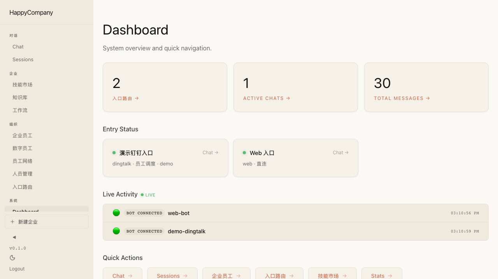<br/><b>Dashboard</b> — System overview, live metrics, WebSocket updates</td>
<td width="50%">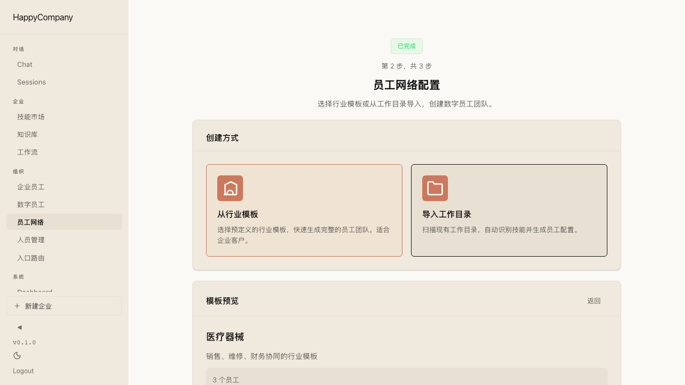<br/><b>Employee Network</b> — Create employees from templates or imported workdirs</td>
</tr>
<tr>
<td width="50%">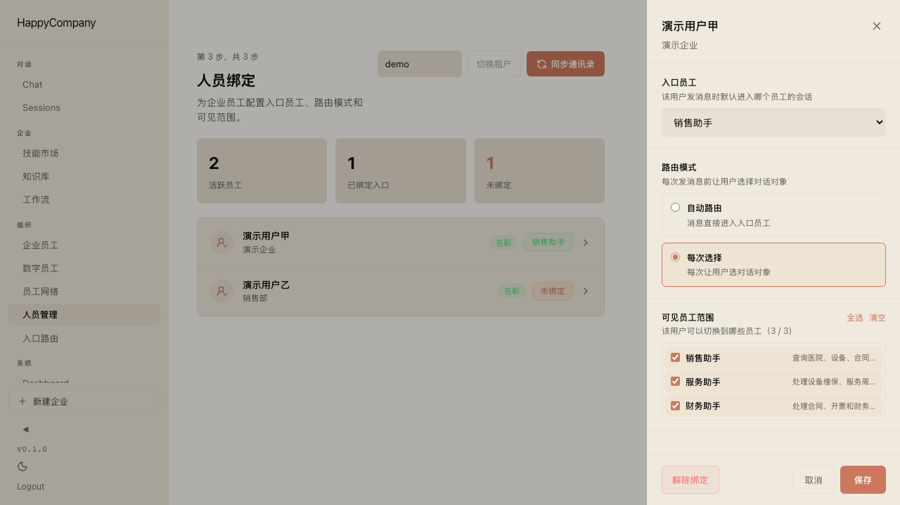<br/><b>People Binding</b> — Map real users to digital employees and selector scopes</td>
<td width="50%">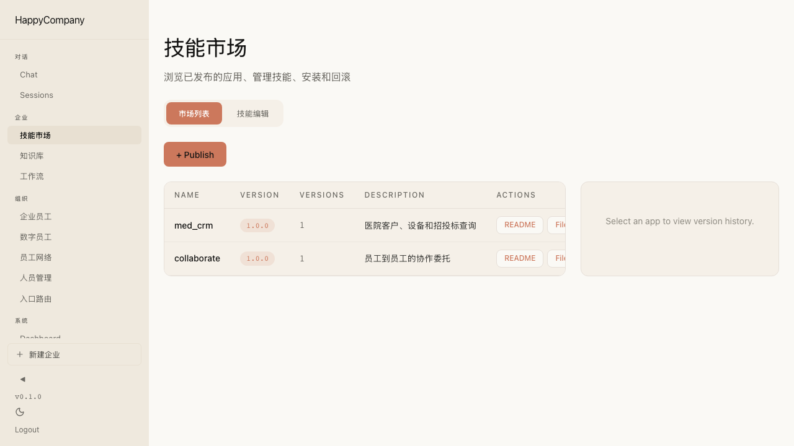<br/><b>Skills Marketplace</b> — Browse, bind, and inspect per-tenant skills</td>
</tr>
<tr>
<td width="50%">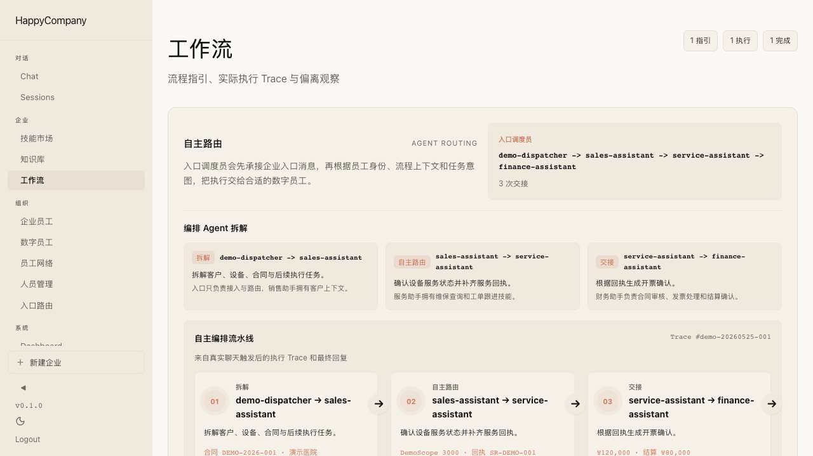<br/><b>Agent Workflow</b> — Trace handoffs across digital employees after entry routing</td>
<td width="50%">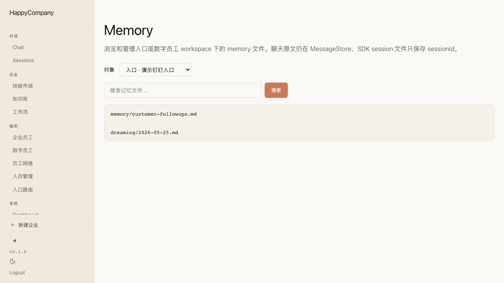<br/><b>Memory</b> — Inspect employee workspace memory and learning notes</td>
</tr>
</table>

---

## How It Works

GitHub renders the diagrams below with Mermaid. Click a diagram on GitHub to open the built-in pan/zoom viewer.

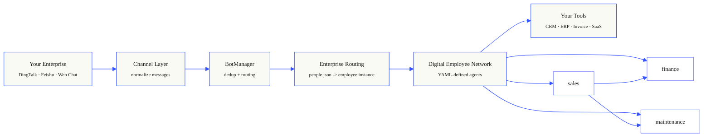

**One-line version**: Anthropic's [financial-services managed agents](https://github.com/anthropics/financial-services), but self-hosted, multi-tenant, and for any industry — not just finance.

---

<details>
<summary><b>Expand the operating model</b></summary>

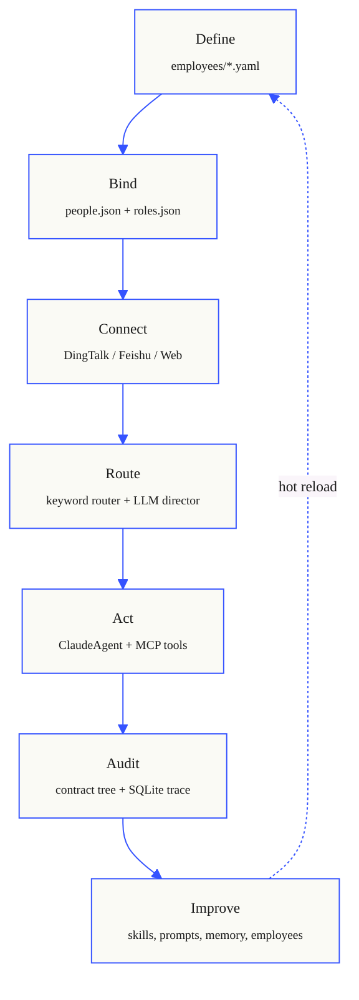

</details>

## Compared To

### vs Anthropic Managed Agents (Engineering Blog)

Anthropic's ["Decoupling the brain from the hands"](https://www.anthropic.com/engineering/managed-agents) defines three interfaces: session, harness, sandbox. HappyCompany applies the same pattern for self-hosted business agents:

| Concept | Anthropic Managed Agents | HappyCompany |
|---------|------------------------|--------------|
| **Brain** (Claude + loop) | Hosted harness in Anthropic cloud | `ClaudeAgent` per employee, on your server |
| **Hands** (tools/sandbox) | Managed containers + MCP proxy | `SkillBridge` + MCP servers + Python app servers |
| **Session** (event log) | Hosted durable event stream | File-based JSON + SQLite `ContractStore` |
| **Many brains** | Scale stateless harnesses | Employee network with directed handoff graph |
| **Security boundary** | Token vault + proxy, sandbox isolation | `AuthGate` deny-by-default + strict tool policy |
| **Model choice** | Anthropic models only | Heterogeneous (Claude, GLM, any OpenAI-compatible) |
| **Deployment** | SaaS (Anthropic runs it) | Self-hosted (your infra, your data) |

### vs Anthropic `financial-services` (Cookbook Format)

| Concept | Anthropic `financial-services` | HappyCompany |
|---------|-------------------------------|--------------|
| Agent definition | `agent.yaml` in cookbooks | `employees/*.yaml` per tenant |
| Sub-agents / handoff | `callable_agents` (1 level deep) | `allowedTargets` (N levels, directed graph) |
| Skills | Plugin skills via `from_plugin` | `.claude/skills/` per tenant |
| Tool access | Tool-level enable/disable flags | Role-based deny-by-default (`roles.json`) |
| Orchestration | External event bus (Temporal/Airflow) | Built-in `HandoffEngine` + `ContractStore` |
| Domain | Financial services vertical | Any business (sales, finance, maintenance, HR...) |
| Agent creation | Engineers write YAML | Engineers OR business users (**NL Agent Builder**) |

### vs Other Agent Frameworks

| | HappyCompany | CrewAI | LangGraph | AutoGen |
|---|---|---|---|---|
| **Focus** | Business operations | Role-based teams | General agent graphs | Multi-agent conversations |
| **Deployment** | Self-hosted, private | Library | Library | Library |
| **Channel integration** | DingTalk, Feishu, Web Chat | None built-in | None built-in | None built-in |
| **RBAC** | Deny-by-default, per-role tool whitelist | No | No | No |
| **Agent definition** | YAML (declarative) | Python code | Python code | Python code |
| **NL agent creation** | Built-in Agent Builder | No | No | No |
| **Audit trail** | Contract lifecycle + SQLite | No built-in | Custom | Custom |
| **Multi-tenant** | Yes (corp/{tenant}/) | No | No | No |
| **Non-engineer friendly** | Yes (NL → YAML) | No | No | No |

---

## Key Features

| Feature | What it means |
|---------|--------------|
| **Dynamic orchestration** | Agents decide their own handoffs — no hardcoded workflows, routing emerges from context |
| **Managed employee network** | Define agents in YAML, each with its own model, tools, and access policy |
| **Contract audit trail** | Every handoff creates a parent-child contract tree, persisted to SQLite |
| **Role-based tool access** | Sales queries CRM; finance processes invoices — deny-by-default |
| **Heterogeneous models** | Dispatcher on GLM-5-turbo ($0.001/query), experts on Claude Sonnet |
| **Channel adapters** | Same employee network serves DingTalk, Feishu, and Web Chat |
| **Guided Agent Builder** | Describe your business in NL → generates YAML + skills + RBAC |
| **Day-1 private deployment** | Self-hosted. No data leaves your server. No cloud dependency |
| **Hot reload** | Add/modify employees without restart |
| **Event-driven triggers** | Domain events automatically invoke agents — not just chat messages |

---

## Quick Start

```bash
# 1. Clone & install
git clone https://github.com/arnow117/happycompany.git
cd happycompany && npm install

# 2. Configure
cp config.example.json config.json
# Edit config.json — set your LLM API key

# 3. Create your first employee
mkdir -p corp/default/employees
cat > corp/default/employees/greeter.yaml << 'EOF'
id: greeter
displayName: Greeter
description: A friendly greeting agent
model: claude-sonnet-4-6
systemPrompt: |
  You are a friendly company greeter.
  Respond warmly, ask how you can help.
  If they need a specialist, use the handoff tool.
tools: [Bash, Skill]
maxTurns: 10
EOF

# 4. Run
npm run dev
# → http://localhost:3100 (admin dashboard served from web/dist)
```

That's it. Open the dashboard, go to Chat, and talk to your first digital employee.

For frontend hot reload during development, run the Vite server in a second terminal:

```bash
cd web && npm run dev
# → http://localhost:8888
```

---

## For Forward-Deployed Engineers

The Quick Start above stands up **one** company. But that's not how this is built to be used at scale.

HappyCompany is a **delivery toolchain**, not a multi-tenant SaaS. You don't onboard clients into one shared instance — you stamp out a **dedicated digital-employee organization per client** from an industry template, tune it to their domain, and run it on their infrastructure. The open-source repo ships the **skeleton + industry templates**; every client is a **fork**.

> **面向前置工程师 (FDE):** 这个仓库开源的是「骨架 + 行业模板」。给每个客户交付时,你从行业模板 `fde:new` 出一个独立组织,改 prompt、绑人员,跑在客户自己的环境里。客户的业务数据永远不进开源仓库。

### The fork-per-client model

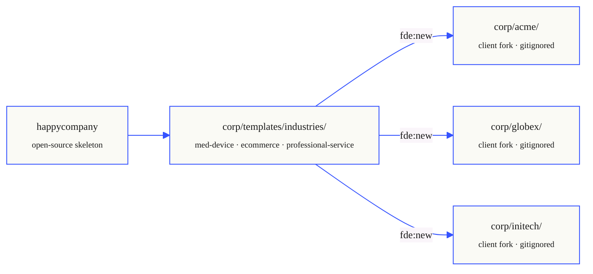

Client folders live under the configured corp root: `corp/<client>/` by default, or `$HAPPYCOMPANY_CORP_DIR/<client>/` in production. They are runtime/customer state, not platform source. Their employee prompts, people bindings, contracts, and memory never touch the open-source history — keep each one in the client's private repo or local only.

### Scaffold a client in one command

```bash
npm run fde:new -- acme --from-template med-device --display-name "Acme Medical"
```

For production-style local scaffolding, point the tool at the same corp root the platform will scan:

```bash
export HAPPYCOMPANY_CORP_DIR=/srv/happycompany/corp
npm run fde:new -- acme --from-template med-device --display-name "Acme Medical"
```

```text
✓ Created tenant: acme

  Organization structure
  │
  ├─ Roles (5)
  │  ├─ admin              管理员 (*all*)
  │  ├─ sales              销售 (0 tools)
  │  ├─ finance            财务 (0 tools)
  │  ├─ maintenance        维修 (0 tools)
  │  └─ member             员工 (0 tools)
  │
  ├─ Employees (3)
  │  ├─ finance.yaml
  │  ├─ maintenance.yaml
  │  └─ sales.yaml
  │
  ├─ Contracts: 2  (inter-employee handoff rules)
  └─ Workflows: 3  (cross-employee processes)
```

You get a working org — roles, employees, inter-employee handoff contracts, and cross-employee workflows — out of the box. Then you do the FDE part: tune `employees/*.yaml` prompts to the client's real domain, bind real users in `people.json`, and connect their channels.

### Industry templates

| Template | `--from-template` | Roles | Built-in workflows |
|----------|-------------------|-------|--------------------|
| 医疗器械 Medical Devices | `med-device` | sales · maintenance · finance | bid-tracking → contract handoff → maintenance → finance |
| 电商零售 E-commerce | `ecommerce` | customer-service · operations · warehouse | order / fulfillment / refund chains |
| 专业服务 Professional Services | `professional-service` | project-manager · consultant · finance | project → deliverable → milestone → invoice |
| 通用 General | `general` *(default)* | minimal starter | — |

Each template defines its `businessObjects`, `roles`, employee prompts, handoff `contracts/`, and `workflows/`. Adding a vertical = adding a folder under `corp/templates/industries/`.

```bash
# Discover available templates / options
npm run fde:new -- --help
```

---

## Architecture

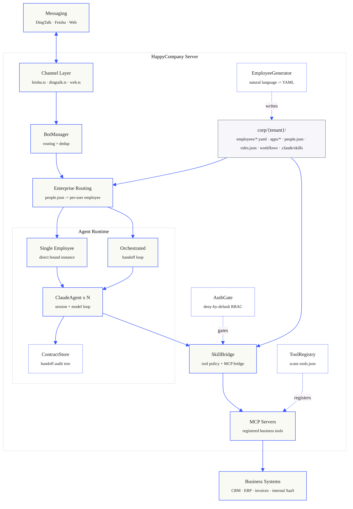

<details>
<summary><b>Expand the tenant data model</b></summary>

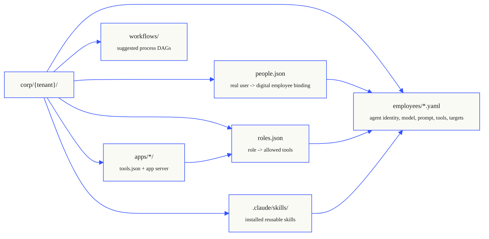

</details>

---

## Dynamic Orchestration — Not Another Static Workflow

Traditional enterprise automation hardcodes every path: *if this, then that*. BPMN diagrams, approval chains, fixed routing tables. Change one step and you redeploy the whole pipeline.

HappyCompany agents collaborate **dynamically** — the routing emerges from the task itself, not a pre-defined flowchart.

### Traditional Workflow vs Agent Network

| | Traditional BPM/Workflow | HappyCompany Agent Network |
|---|---|---|
| **Routing** | Hardcoded if/else branches | Agents decide who to call based on context |
| **Path** | Single fixed path per trigger | Multiple valid paths; agents pick the right one |
| **Adaptation** | Change the diagram → redeploy | Add a new employee YAML → immediately available |
| **Edge cases** | Not in the diagram → error | No match? Ask the LLM. Still no match? Ask the user. |
| **Tool access** | Everyone on the pipeline sees everything | Each agent only accesses its approved tools |
| **Audit** | Log entries in a table | Contract tree with parent-child relationships |
| **Creation** | Developer draws BPMN in a designer | Engineer writes YAML **or** business user describes in NL |

### How Dynamic Routing Works

When a message arrives, the **dispatcher** doesn't follow a flowchart. It uses a two-tier router:

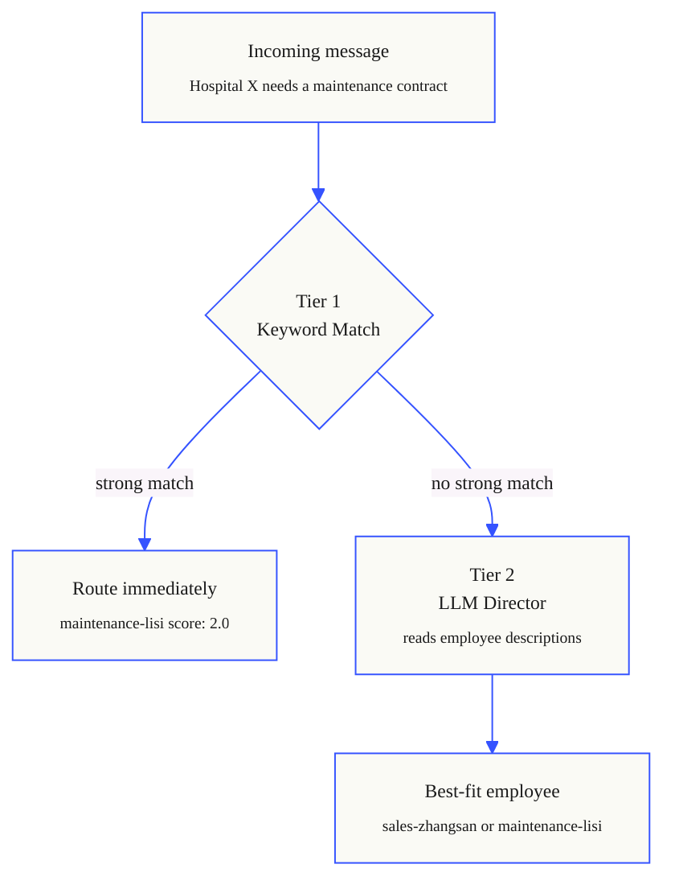

### Agents Decide Their Own Handoffs

Once the dispatcher routes to an agent, **that agent decides** what happens next. It can:

1. **Handle it directly** — task complete
2. **Hand off to a specific agent** — "pass this to finance for invoicing"
3. **Ask the director** — "I need someone who handles maintenance scheduling" → director finds the best match
4. **Ask the user** — "Should I generate a quote or schedule a site visit first?"

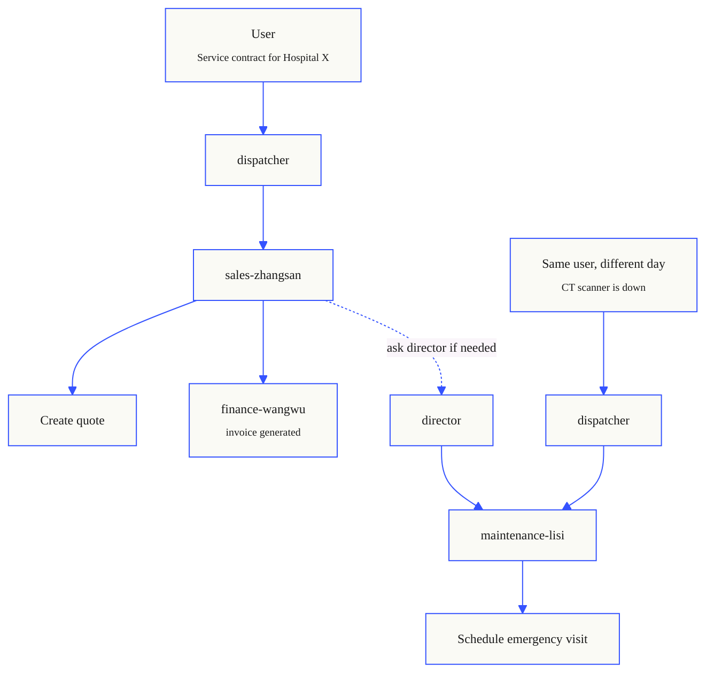

The path is **not hardcoded** — it emerges from the task. Add a new `hr-onboarding` employee, and the dispatcher immediately knows how to route HR requests without any flowchart changes.

### Contract Tree — Full Audit Trail

Every handoff creates a **parent-child contract tree** persisted to SQLite:

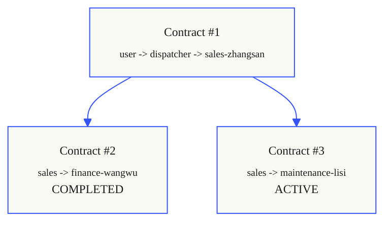

Each contract has a lifecycle: `pending → active → done/failed`. If a sub-task fails, the parent contract is notified and can retry or re-route. The full tree is queryable for compliance audits.

### Event-Driven Triggers (Not Just Chat)

Agents don't only respond to chat messages. The **EventBridge** subscribes to domain events and triggers agents automatically:

```yaml
# An employee can declare event triggers
schedule:
  triggers:
    - type: event
      value: contract.created
      prompt: "New contract {{contractId}} for {{customer}}. Please schedule maintenance."
      enabled: true
```

When `contract.created` fires on the MessageBus, the maintenance agent is automatically invoked — no human in the loop.

---

## Guided Agent Builder

Not just for engineers. Business users create agents by describing what they need:

```
"I need a sales agent that looks up hospital info from our CRM,
 creates quotes, and hands off invoicing to finance."

→ Generates:
  ├── employees/sales-zhangsan.yaml  (system prompt, tools, allowedTargets)
  ├── roles.json update              (sales role with approved tools)
  └── Skill scaffolding              (for any new capabilities)
```

The `EmployeeGenerator` uses Claude to parse NL → generate Zod-validated YAML → infer role and tool policy → scaffold skills. Triggered via admin dashboard or chat.

---

## Enterprise People Binding

Real users map to digital employees via `people.json` — one human can have multiple role-bound assistants:

```json
{
  "userId": "user-001",
  "name": "Alice",
  "roleBindings": [
    { "role": "sales", "assistantId": "sales-zhangsan" },
    { "role": "finance", "assistantId": "finance-wangwu" }
  ]
}
```

When Alice messages the DingTalk bot, the `enterprise-routing` layer resolves which digital employee handles it based on her active role.

---

## Role-Based Access Control

`roles.json` enforces deny-by-default tool access:

```json
{
  "roles": {
    "admin": { "tools": ["*"] },
    "sales": {
      "tools": ["med_crm:query_hospital", "med_crm:query_device", "med_crm:create_quote"]
    },
    "finance": {
      "tools": ["med_crm:create_invoice", "human-invoice"]
    }
  },
  "users": {
    "employee:sales-zhangsan": "sales",
    "employee:finance-wangwu": "finance"
  }
}
```

Enterprise employees can ONLY use approved skills. No file system access, no arbitrary Bash — business tools must go through registered skill+CLI entrypoints.

---

## Connecting Channels

```jsonc
// DingTalk
{ "channel": "dingtalk", "credentials": { "client_id": "...", "client_secret": "..." } }

// Feishu/Lark
{ "channel": "feishu", "credentials": { "appId": "...", "appSecret": "..." } }

// Web Chat (no credentials needed)
{ "channel": "web" }
```

---

## Tech Stack

| Layer | Technology |
|-------|-----------|
| Backend | Node.js + TypeScript + Hono |
| Agent Runtime | Claude Agent SDK (`@anthropic-ai/claude-agent-sdk`) |
| Frontend | React + Vite + Zustand |
| Validation | Zod v4 |
| Logging | Pino |
| App Servers | Python (optional, via JSON-RPC) |
| Testing | Vitest |

---

## Development

```bash
npm run dev                    # Backend with hot reload
cd web && npm run dev          # Frontend → http://localhost:8888
npx tsc --noEmit               # Type check
npx vitest run                 # Run tests
cd web && npm run build        # Build frontend for production
```

| Port | What |
|------|------|
| 8888 | Frontend (Vite HMR, dev only) |
| 3100 | Backend API + serves `web/dist/` |

---

## Project Structure

```
src/
├── index.ts                     # Bootstrap, wiring, hot reload
├── agent.ts                     # ClaudeAgent — LLM session management
├── bot.ts                       # BotManager — routing + dedup
├── channel.ts                   # ChannelAdapter interface
├── feishu.ts / dingtalk.ts      # Channel implementations
├── auth-gate.ts                 # RBAC engine
├── enterprise-*.ts              # People, routing, tool policy
├── tool-registry.ts             # Scans tools.json manifests
├── tenant.ts                    # Multi-tenant directory scanner
├── orchestrator/
│   ├── employee-colony.ts       # Employee registry + AgentAdapter
│   ├── employee-loader.ts       # YAML → Zod + hot reload
│   ├── employee-generator.ts    # NL → YAML agent builder
│   ├── handoff-engine.ts        # Multi-agent handoff + contracts
│   ├── director-router.ts       # Keyword + LLM routing
│   ├── skill-bridge.ts          # Tools → MCP bridge
│   └── contract-store.ts        # SQLite contract persistence
├── prompts/                     # Template system
├── routes/                      # Admin API
└── feishu-cards/                # Card builder utilities

corp/{tenant}/                   # Per-business data
├── employees/*.yaml             # Agent definitions
├── apps/*/tools.json            # Tool manifests
├── roles.json                   # RBAC
├── people.json                  # User directory
└── .claude/skills/              # Installed skills
```

### Coding Agent Friendly

- **File-per-responsibility** — each module has a clear, single purpose
- **Zod schemas as contracts** — `employee-schema.ts`, `tool-schemas.ts` define data shapes
- **CLAUDE.md in repo** — full project context for AI assistants
- **YAML-first definitions** — agents, roles, workflows are declarative and diff-friendly
- **Convention over configuration** — tenant structure follows predictable `corp/{tenant}/` layout

---

## Roadmap

- [ ] Plugin marketplace — share and install tenant-specific skill packs
- [ ] Visual agent builder — drag-and-drop employee network designer
- [ ] Multi-tenant sandboxing — separate process per tenant
- [ ] Evaluation harness — automated agent behavior testing
- [ ] Observability dashboard — real-time handoff visualization

---

## License

MIT
