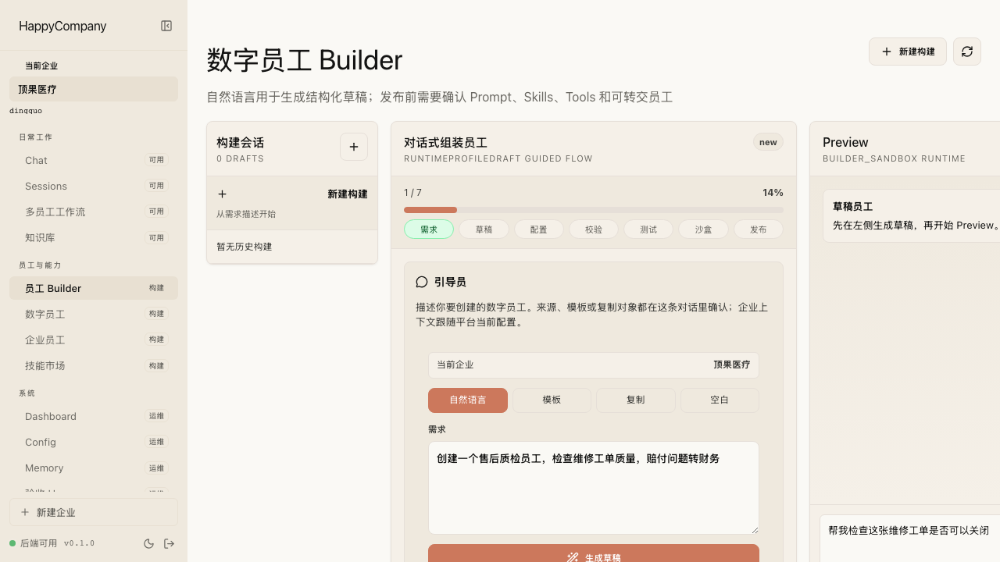
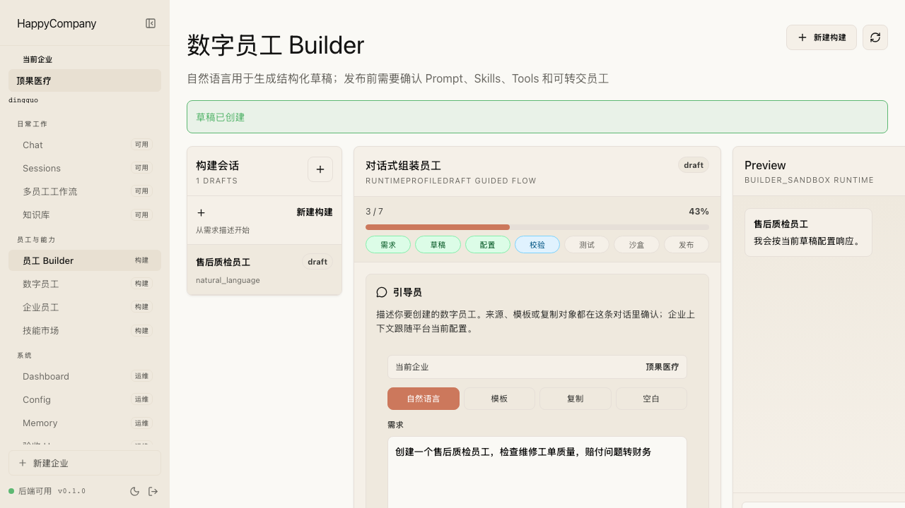
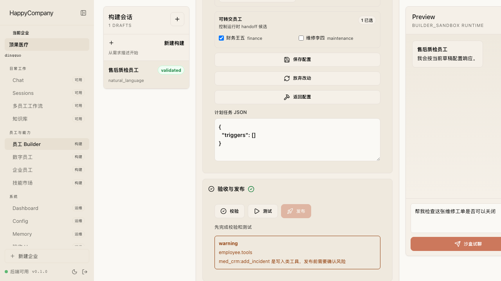
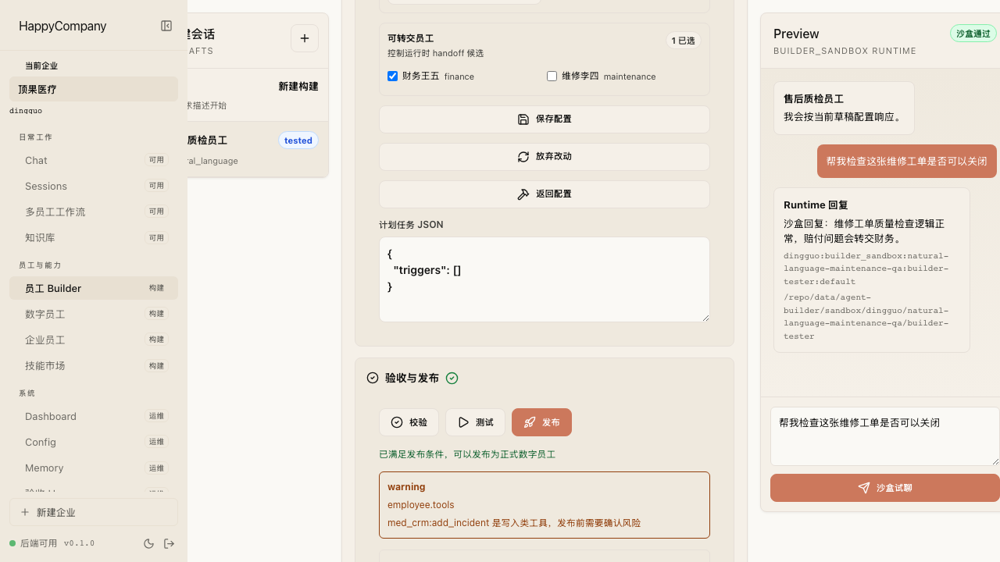
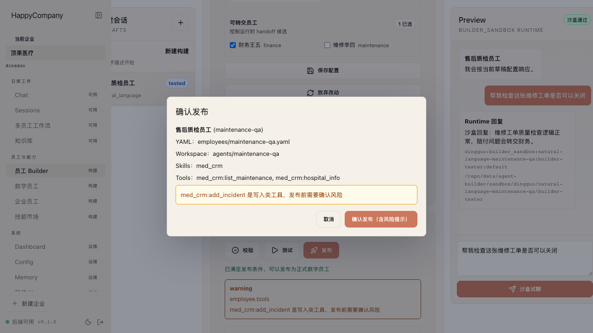
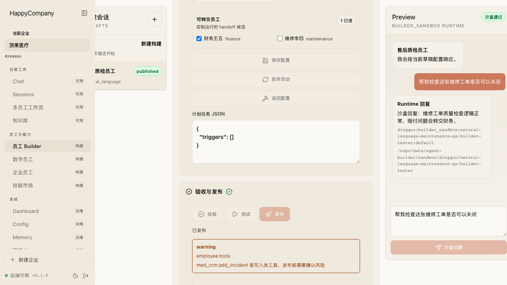

# Agent Builder 迭代用户故事说明

日期：2026-05-31

## 一句话变化

这波迭代把“创建数字员工”从偏工程配置的 YAML/代码流程，推进成了一个管理员可以在 Web 上完成的产品化流程：用自然语言起草、在结构化表单里确认能力与边界、先跑测试、再进 Runtime 沙盒试聊，最后发布成企业里的数字员工。

## 以前的用户故事

作为企业管理员，我想新增一个数字员工时，实际需要理解员工 YAML、技能目录、工作目录、MCP/tool 权限、路由绑定、实例发布等概念。

这导致两个问题：

- 我很难判断“这个员工到底能做什么、不能做什么”。
- 我也很难在发布前验证它是否能被正确路由、是否会拿到过大的能力、是否能在自己的工作目录里运行。

## 现在的用户故事

作为企业管理员，我可以从一句业务描述开始创建数字员工。系统会把这句话整理成一个可审核的草稿，而不是直接发布。

创建后，我会进入结构化编辑界面。这里不再要求我直接编辑 YAML，而是把数字员工拆成几个可理解的配置区：基本身份、人格提示、技能、MCP 工具、工作目录、可服务对象，以及测试与发布状态。

这意味着我可以用两种方式工作：

- 用自然语言快速生成第一版草稿。
- 直接在结构化表单里精修员工的人格、技能、权限和服务范围。

## 这个智能体到底能用什么能力

在这次迭代里，数字员工的能力被拆成三层：

第一层是平台原生工具。
这类工具不是管理员在 Builder 里选择的，而是平台为了让数字员工能稳定运行而注入的基础能力，例如运行授权业务技能、读写自己工作目录下的 memory、把任务转交给允许的其他数字员工。它们受平台代码和权限模型控制，不应该作为普通业务工具随便开放。

第二层是 Skill。
Skill 更像一个业务能力包或业务应用，例如 `med_crm` 代表医院 CRM 能力包。管理员选择 skill，表达的是“这个数字员工属于哪个业务领域、能接触哪一类业务能力”。在示例医疗示例里，销售、维保、财务员工都会绑定 `med_crm`，但角色不同，能调用的具体工具不同。

第三层是 Tool。
Tool 是 skill 下面的具体动作，例如：

- `med_crm:global_search`：全局搜索。
- `med_crm:hospital_info`：查询医院详情。
- `med_crm:search_devices`：搜索装机设备。
- `med_crm:list_maintenance`：查看维保合同。
- `med_crm:add_sales_activity`：新增销售拜访记录。
- `med_crm:add_contact`：新增联系人。
- `med_crm:add_incident`：新增维修工单或故障记录。

这些 tool 会带风险等级。只读查询是 `read`，写入企业内部数据是 `internal_write`，未来外部发送、删除、付款等动作会归到更高风险等级。Builder 的校验会提醒高风险 tool，并用租户的 `roles.json` 判断当前角色是否有权调用。

因此用户真正需要理解的是：

- 选 skill：给员工一个业务能力包。
- 选 tool：限定这个员工在能力包里能做哪些具体动作。
- 选角色：决定这些 tool 是否真的被权限模型允许。
- 选可调度员工：决定它能把任务转交给谁。

目前截图里的表达还偏工程化，只展示了 `Skills` 和 `Tools` 列表。产品上后续应该把它改成“业务能力包 / 可执行动作 / 风险等级 / 权限来源”的组合视图，这样管理员不用理解底层 YAML 也能知道自己到底开放了什么。

## 发布前先知道风险

作为管理员，我不希望一个“看起来能发布”的员工在真实会话里才暴露问题。因此现在的流程在发布前增加了校验。

校验会把配置问题用产品语言暴露出来，例如：名称、工作目录、技能、工具权限、服务范围、路由约束等。用户看到的是“哪里需要修”，不是一段底层异常。

这一步的产品含义是：数字员工不再是“写完就上线”，而是先经过一层平台治理。

## 发布前先跑一遍

作为管理员，我还可以在发布前跑 Harness 测试。测试不是为了证明页面按钮能点，而是为了验证这个员工放进 Happy Company 的真实架构后，是否满足关键平台约束：

- 是否只拿到被授权的技能和 MCP 工具。
- 是否使用自己的实例工作目录。
- 是否能被企业路由正确发现。
- 是否不会绕过 RBAC 和发布状态。
- 修改草稿后是否需要重新测试。

## 发布前进 Runtime 沙盒试聊

Harness 通过后，发布仍不会直接放行。管理员还需要用 Runtime 沙盒发起一条真实运行链路里的试聊，确认草稿 overlay、运行工作目录、session 写入和回复链路都能工作。

这一步的意义是：Builder 不再只依赖 fake trace 或静态校验，而是把草稿放进统一的 Runtime Profile / MessageIngressRuntime 路径里跑一遍。沙盒会写入 `builder_sandbox` 模式的 Runtime Session，但不会写入正式员工 YAML 或生产 workspace。

## 最后才发布

当校验、Harness 测试和 Runtime 沙盒都通过后，发布动作会变成明确的确认，而不是一个隐藏在配置里的副作用。管理员能看到这次发布会创建哪个员工、写入哪个工作目录、开放哪些技能和工具。

发布成功后，这个数字员工会进入平台的员工体系，后续可以被绑定、路由、试聊和纳入企业工作流。

## 对用户意味着什么

这波迭代的核心不是“多了一个表单”，而是把数字员工从工程资产变成了平台资产。

对企业管理员：

- 可以用自然语言快速创建数字员工草稿。
- 可以在 Web 上确认结构化配置，而不是读写 YAML。
- 可以在发布前看见权限、工作目录、技能和路由边界。
- 可以先测试、再沙盒试聊、最后发布，降低把错误员工放进真实业务流的风险。

对最终业务用户：

- 绑定到的数字员工更稳定，因为发布前已经经过基本校验。
- 数字员工的能力边界更清楚，不会因为历史配置债拿到不该有的工具。
- 后续在钉钉、飞书、Web 聊天入口里，平台更容易解释“为什么这条消息交给这个员工处理”。

对平台自身：

- Agent Builder 成为后续“企业自助创建数字员工”的入口。
- Harness 测试从单纯测试工具，变成了发布门禁的一部分。
- 员工实例、工作目录、技能、MCP 权限、路由绑定这些核心概念在产品层被统一起来。

## 本轮验收覆盖

本轮已经完成的验证包括：

- 后端类型检查：`npm run typecheck`
- 后端单元与集成测试：`npx vitest run`
- Harness 故事测试：`npm run harness:fake`
- 前端单元测试：`cd web && npm test`
- 前端构建：`cd web && npm run build`
- Playwright E2E：`cd web && npx playwright test`
- Agent Builder 截图故事：`cd web && npx playwright test e2e/story-v2-agent-builder-doc/agent-builder-doc.spec.ts`

其中 Agent Builder 截图故事专门覆盖了这篇说明里的 7 个关键页面状态。
